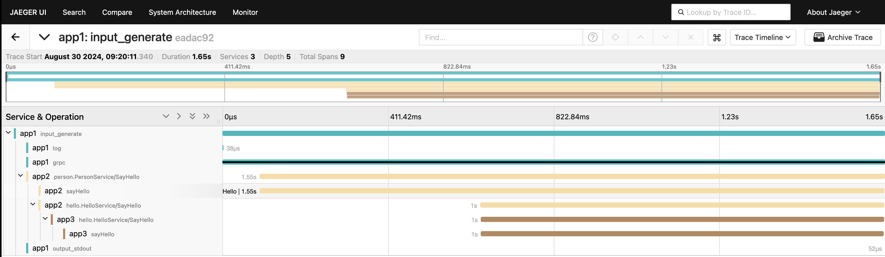

# Open Telemetry gRPC distributed tracing

```sh
docker-compose up
```

Access the Jaeger UI at http://localhost:16686/



traceID propagation and usage in logs:
```log
app1    | level=info msg=input @service=benthos json="{\"id\":\"59dcf6d8-707b-425b-bfa2-5dda75293509\",\"name\":\"david\"}" label="" path=root.pipeline.processors.0 traceID=ea582915f8b7b637088951cb109be17f
app2    | 2024/08/30 09:23:42 message="saying hello to david (id: 59dcf6d8-707b-425b-bfa2-5dda75293509)" traceID=ea582915f8b7b637088951cb109be17f
app3    | 2024/08/30 09:23:43 message="saying hello to david" traceID=ea582915f8b7b637088951cb109be17f
```
